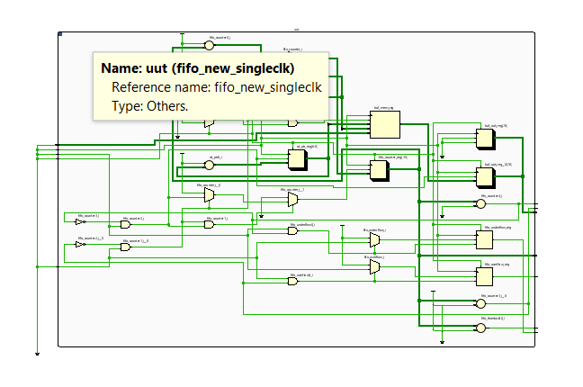
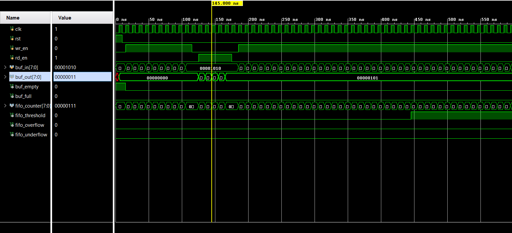

# FIFO-single-and-dual-clock-

# Single Clock FIFO Buffer

A synchronous FIFO (First In, First Out) buffer implementation in Verilog with built-in overflow/underflow detection and configurable threshold monitoring.

## Features

- **Single Clock Domain**: All operations synchronized to one clock
- **8-bit Data Width**: Supports 8-bit input/output data
- **64-entry Deep**: Buffer memory of 64 locations
- **Status Flags**: Empty, full, and threshold indicators
- **Error Detection**: Overflow and underflow condition monitoring
- **Configurable Threshold**: Default threshold set at 50% capacity (32 entries)

## Module Interface

### Inputs
- `clk` - Clock signal (positive edge triggered)
- `rst` - Asynchronous reset (active high)
- `wr_en` - Write enable signal
- `rd_en` - Read enable signal  
- `buf_in[7:0]` - 8-bit input data

### Outputs
- `buf_out[7:0]` - 8-bit output data
- `buf_empty` - Empty flag (high when FIFO is empty)
- `buf_full` - Full flag (high when FIFO is full)
- `fifo_counter[7:0]` - Current number of entries in FIFO
- `fifo_threshold` - Threshold flag (high when ≥32 entries)
- `fifo_overflow` - Overflow flag (high when write attempted to full FIFO)
- `fifo_underflow` - Underflow flag (high when read attempted from empty FIFO)

## Operation

### Write Operation
- Data is written to FIFO when `wr_en` is high and FIFO is not full
- Write pointer automatically increments after each successful write
- Attempting to write to a full FIFO sets the overflow flag

### Read Operation
- Data is read from FIFO when `rd_en` is high and FIFO is not empty
- Read pointer automatically increments after each successful read
- Attempting to read from an empty FIFO sets the underflow flag

### Status Monitoring
- **Empty**: `fifo_counter == 0`
- **Full**: `fifo_counter == 64`
- **Threshold**: `fifo_counter >= 32`
- **Counter**: Tracks current number of stored entries

## Implementation Details

### Memory Organization
- **Buffer Size**: 64 x 8-bit memory array
- **Pointer Width**: 7-bit pointers (0-63 addressing)
- **Circular Buffer**: Pointers wrap around automatically

### Error Handling
- **Overflow**: Set when attempting to write to full FIFO, cleared on next read
- **Underflow**: Set when attempting to read from empty FIFO, cleared on next write

### Reset Behavior
- All pointers reset to 0
- FIFO counter reset to 0
- Output buffer cleared
- Error flags cleared

## Timing Characteristics

- **Write Latency**: 1 clock cycle
- **Read Latency**: 1 clock cycle
- **Flag Update**: Combinational (same cycle)
- **Counter Update**: 1 clock cycle

## Verification Considerations

When testing this FIFO, verify:
1. Correct write/read pointer management
2. Accurate counter tracking
3. Proper flag generation
4. Error condition detection
5. Reset functionality
6. Simultaneous read/write operations

## Design Diagrams

### Block Diagram
The following diagram shows the high-level block representation of the FIFO module:

*Figure 1: FIFO module block diagram showing input/output interface*

### RTL Schematic
The elaborated RTL schematic shows the internal implementation details:

*Figure 2: Elaborated RTL schematic showing internal logic implementation with registers, multiplexers, and control logic*

The RTL schematic reveals:
- **Memory Array**: 64x8-bit register array for data storage
- **Pointer Logic**: 7-bit read and write pointer registers with increment logic
- **Counter Logic**: 8-bit counter with increment/decrement control
- **Flag Generation**: Combinational logic for empty, full, and threshold flags
- **Control Logic**: Write/read enable gating and error detection

## Simulation Results

The following waveform shows the functional verification of the FIFO module:

*Figure 3: Simulation waveform showing FIFO operation over 550ns*

## Contributing

Contributions are welcome! Please ensure all changes are properly tested and documented.
